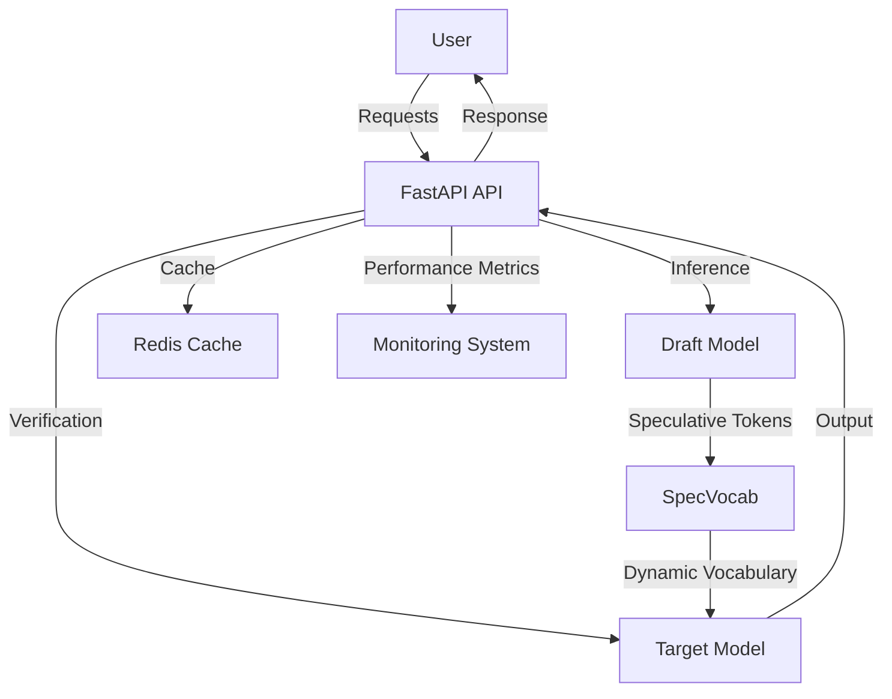

# Speculative Decoding with SpecVocab 🚀

 
 
 


---

## 🌍 Project Overview

Speculative Decoding with SpecVocab is a cutting-edge solution that revolutionizes language model inference by optimizing computational efficiency and reducing latency. This repository implements **SpecVocab**, an advanced speculative decoding method that dynamically selects vocabulary subsets for each decoding step. By doing so, it accelerates the inference process without compromising the quality of generated text.

This project is built with a robust architecture that leverages modern technologies, enabling scalable, high-performance deployments in production environments.

---

## 💡 Societal Problem Addressed

The increasing computational cost and latency of language model inference significantly hinder the scalability and accessibility of AI-powered applications. This is particularly challenging for resource-constrained environments, limiting the adoption of AI in critical domains such as:

- **Education**: Reducing the barrier to provide personalized learning experiences in underserved areas.
- **Healthcare**: Making AI-powered diagnostics and insights accessible in low-resource settings.
- **Low-resource Areas**: Enabling AI applications in regions with limited infrastructure.

By dramatically optimizing the inference process, this project makes AI more accessible and scalable, contributing to the democratization of artificial intelligence.

---

## 🏗️ Architecture

The architecture of this project is designed around the principles of efficiency, scalability, and modularity:

1. **Draft Model**: A lightweight language model that generates speculative tokens with high efficiency.
2. **Target Model**: A larger, more accurate language model that verifies and refines the speculative output.
3. **SpecVocab Module**: A dynamic vocabulary management system that selects adaptive subsets of vocabulary for each decoding step, reducing computational overhead.
4. **Backend API**: A FastAPI-based backend that exposes endpoints for model inference, health checks, and benchmarks.
5. **Redis Cache**: A caching layer for storing intermediate results and improving response times.
6. **Containerization and Orchestration**:
   - **Docker** is used for containerization.
   - **Kubernetes** enables scalable and fault-tolerant deployment.

---

## 🚀 Getting Started

Follow these steps to get up and running with the project:

### Prerequisites

- **Docker**: [Install Docker](https://docs.docker.com/get-docker/)
- **Docker Compose**: [Install Docker Compose](https://docs.docker.com/compose/install/)
- **Python 3.10+**: [Install Python](https://www.python.org/downloads/)

### Installation

1. Clone the repository:
   ```bash
   git clone https://github.com/your-repo/speculative-decoding.git
   cd speculative-decoding
   ```

2. Build and start services using Docker Compose:
   ```bash
   docker-compose up --build
   ```

3. Confirm the application is running by visiting:
   ```
   http://localhost:8000/docs
   ```

### Running Tests

Run the following commands to execute the test suite:

- **Integration Tests**:
  ```bash
  pytest backend/tests/test_api.py backend/tests/test_decoding.py
  ```

- **Load Tests**:
  ```bash
  cd load_test
  docker build -t load-test .
  docker run --network host load-test
  ```

- **Performance Reporting**:
  ```bash
  python benchmark/generate_report.py
  ```

---

## ✨ Features

- **Dynamic Vocabulary Subsetting**: SpecVocab dynamically adjusts the vocabulary per decoding step, dramatically reducing inference time.
- **Speculative Decoding Framework**: Combines a lightweight draft model and a highly accurate target model for optimal performance.
- **High Scalability**: Dockerized and Kubernetes-ready for seamless deployment in production environments.
- **Redis-based Caching**: Accelerates inference by caching reusable intermediate results.
- **Monitoring and Benchmarking**:
  - Real-time performance monitoring via Redis.
  - Comprehensive benchmarking tools for throughput and latency evaluation.
- **Multi-Task Support**: Configurable for tasks such as translation, summarization, code generation, and question answering.
- **Configurable Parameters**:
  - Adaptive thresholds.
  - Task-specific scaling factors.
  - Vocabulary subset size limits.

---

## 🛠️ Architecture Diagram



---

## 📊 Benchmarking

This repository includes a benchmarking suite to evaluate the throughput, latency, and memory usage of various decoding strategies. 

### Running Benchmarks
Run the following command to execute benchmarks:
```bash
python benchmark/runner.py
```

### Generating Reports
After running the benchmarks, generate a performance report:
```bash
python benchmark/generate_report.py
```

### Example Output
The benchmarking report includes:
- Throughput (tokens/sec) comparison across different strategies.
- Latency per decoding step.
- Memory usage breakdown.

Sample visualization:


---

## 📦 Deployment

### Docker Compose

To deploy the system locally using Docker Compose:
```bash
docker-compose up --build
```

### Kubernetes Deployment

For deploying on Kubernetes:
1. Create a Kubernetes cluster (e.g., using Minikube or a cloud provider).
2. Use the provided `k8s` manifests to deploy the app and Redis.
   ```bash
   kubectl apply -f k8s/
   ```

---

## 🧠 Future Enhancements

- **GPU Acceleration**: Integrate GPU support for faster inference.
- **Multi-Language Support**: Extend SpecVocab for multilingual models.
- **Advanced Monitoring**: Add more granular metrics and visualizations.
- **Distributed Inference**: Scale decoding across multiple nodes for ultra-high throughput.

---

## 📚 References

- [Speculative Decoding with SpecVocab (Research Paper)](https://arxiv.org/pdf/2602.13836v2)
- [PyTorch Documentation](https://pytorch.org/docs/stable/index.html)
- [FastAPI Documentation](https://fastapi.tiangolo.com/)
- [Redis Documentation](https://redis.io/docs/)
- [Docker Documentation](https://docs.docker.com/)
- [Kubernetes Documentation](https://kubernetes.io/docs/)